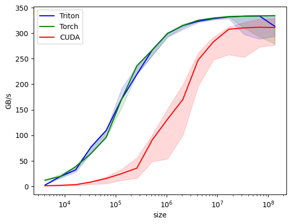

## CUDA/Triton基础Kernel实现以及对比

项目初衷是为了巩固cuda编程以及加深对基础算子实现的理解

### 如何将cuda/c++代码封装到python中

参考链接

[Pytorch+cpp/cuda extension 教學 tutorial 1 - English CC -](https://www.youtube.com/watch?v=l_Rpk6CRJYI&list=PLDV2CyUo4q-LKuiNltBqCKdO9GH4SS_ec)

[CUDA算子测试框架搭建-pybind11的使用介绍](https://zhuanlan.zhihu.com/p/6218767747)

比如此时我们已经写好了cuda/c++的函数接口

```c++
//朴素相加
__global__ void _addKernel(float* __restrict__  src1, float* __restrict__  src2, float* __restrict__ dst, int numel){
    int m_idx = blockIdx.x*blockDim.x+threadIdx.x;
    #pragma unroll
    for(int idx = m_idx; idx < numel; idx += gridDim.x*blockDim.x){
        dst[idx] = src1[idx] + src2[idx];
    }
}

void add(torch::Tensor src1_tensor, torch::Tensor src2_tensor, torch::Tensor dst_tensor, int numel){
    // 确保输入和输出张量都是在CUDA上
    TORCH_CHECK(src1_tensor.is_cuda(), "src1 tensor must be on the GPU");
    TORCH_CHECK(src2_tensor.is_cuda(), "src2 tensor must be on the GPU");
    TORCH_CHECK(dst_tensor.is_cuda(), "dst tensor must be on the GPU");
    float *src1 = src1_tensor.data_ptr<float>();
    float *src2 = src2_tensor.data_ptr<float>();
    float *dst = dst_tensor.data_ptr<float>();
    int block_x = 1024;
    //如果使用float4类型，一个线程处理四个元素，所以算grid时要将block_x*4
    int grid_x = (numel + block_x - 1) / (block_x);
    // grid_x = grid_x>65536 ? 65536 : grid_x;
    dim3 grid_dim(grid_x, 1);
    dim3 block_dim(block_x, 1);

    _addKernel<<<grid_dim, block_dim>>>(src1, src2, dst, numel);
    cudaCheckError(cudaPeekAtLastError());
    cudaCheckError(cudaDeviceSynchronize());
}
```

此时add函数就是我们想要python调用的函数，`build.cpp`使用PYBIND11_MODULE注册算子，例如想在python中注册一个名为`add_cuda`的函数

```c++
#include <torch/extension.h>

// 声明函数
void add(torch::Tensor src1_tensor, torch::Tensor src2_tensor, torch::Tensor dst_tensor, int numel);

PYBIND11_MODULE(TORCH_EXTENSION_NAME, m)
{
      // 第一个参数表示注册到python模块中的函数名称，可以替换为其他名字，使用方法为：模块.add_cuda
      // 第二个参数是上面编写的kernel launch 函数，这里需要获得该函数的地址
      // 第三个参数是函数描述，可以修改
      // 后面的py::arg是用来为add_cuda定义参数的，这些参数的数目，顺序必须和add保持一致
      m.def("add_cuda", &add, "Cuda Core add function",
            py::arg("src1"), py::arg("src2"), py::arg("dst"), py::arg("size"));
}
```

`setup.py`用于将上面的cpp代码构建为python包

```python
from setuptools import setup
from torch.utils.cpp_extension import BuildExtension, CUDAExtension
import glob

# 需要编译的文件
source = glob.glob('./build.cpp') + glob.glob('Add.cu')
# source = glob.glob('./*.cu')
setup(
    name='add_op',  # 自定义包名
    ext_modules=[
        CUDAExtension(
            name='my_cuda_ops',  #扩展模块名称，不一定和name相同, import my_cuda_ops
            sources=source,  #源文件
            extra_compile_args={'cxx': ['-O2'],
                                'nvcc': ['-O2']}
        ),
    ],
    cmdclass={
        'build_ext': BuildExtension
    }
)
```

之后在终端输入`python setup.py build_ext --inplace`即可将c++函数构建为python包，通过`import my_cuda_ops`导入包，`my_cuda_ops.add_cuda`调用即可



基准测试cuda算子的性能差一些，目前还不太清楚为什么，可能pytorch做了一些优化, 争取一天更新一个算子

TODO

- [ ] 矩阵转置的triton实现
- [ ] 归约
- [ ] softmax
- [ ] GEMM
- [ ] FlashAttention